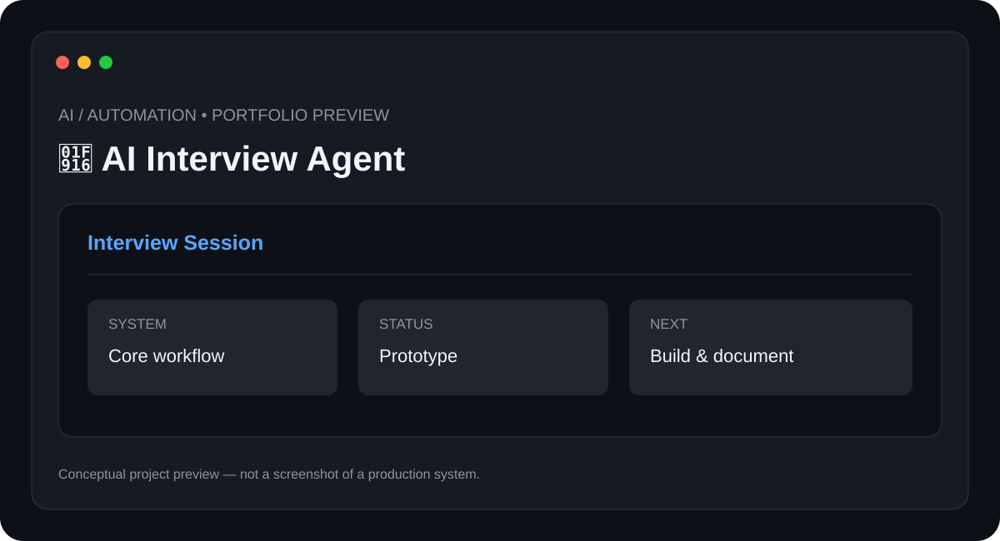

# 🤖 AI Interview Agent

> **AI / Automation** · **Status: Prototype / Portfolio Project**



An AI-assisted interview practice system designed to simulate interview sessions, generate questions, evaluate responses, and provide structured feedback.

## ✨ Features

- Role-specific interview questions
- Interactive question-and-answer flow
- AI-generated feedback
- Response quality analysis
- Session summary and improvement suggestions

## 🧰 Tech Stack

- **Python**
- **AI APIs**
- **REST APIs**
- **Prompt Engineering**

## 📁 Suggested Structure

```text
AI-Interview-Agent/
├── README.md
├── preview.svg
├── src/ or app/
├── docs/
└── tests/
```

The implementation structure can evolve as the project is developed.

## ⚙️ Setup

1. Clone the repository.
2. Install the required runtime/tools for the stack above.
3. Configure any required environment variables, API keys, devices, or services.
4. Install project dependencies.
5. Run the project using the implementation-specific command documented here once the source is added.

### Initial setup checklist

- [ ] Install Python 3.10+
- [ ] Create a virtual environment
- [ ] Install dependencies
- [ ] Configure an AI API key through environment variables
- [ ] Run the application

> 🔐 Never commit API keys, passwords, private tokens, or device credentials.

## 🧪 Project Status

**Prototype / Portfolio Project**

This repository is being documented as part of my technical portfolio. The project description and roadmap are based on the project listed in my resume; implementation details will be updated as the project is built and tested.

## 🗺️ Roadmap

1. ⬜ Add multiple interview modes
2. ⬜ Add persistent session history
3. ⬜ Add scoring dashboards
4. ⬜ Add voice interview support

## 📸 Preview

The included `preview.svg` is a **conceptual project preview**, not a fabricated production screenshot. Real screenshots will replace it after the corresponding implementation is built.

## 🤝 Contributing

This is currently a personal portfolio project. Suggestions and learning resources are welcome.

## 📄 License

No license has been selected yet. Licensing will be added when the project reaches a publishable implementation stage.

---

**Built and documented by [Mr-S-96](https://github.com/Mr-S-96).**
