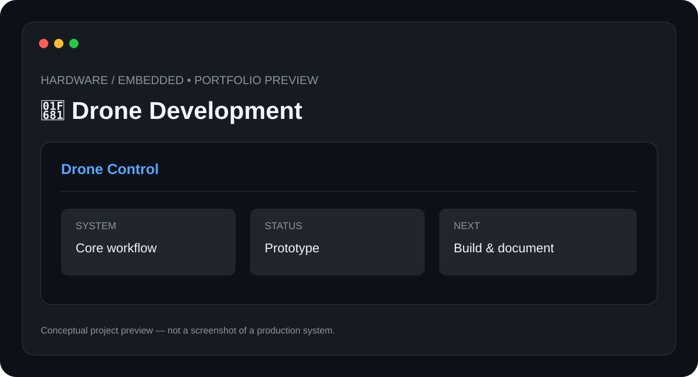

# 🚁 Drone Development

> **Hardware / Embedded** · **Status: Prototype / Hardware Project**



A drone-development project focused on understanding flight systems, sensor integration, control logic, and hardware experimentation.

## ✨ Features

- Flight-control architecture
- Sensor integration planning
- Motor and ESC control
- Telemetry concept
- Modular hardware design

## 🧰 Tech Stack

- **Embedded Systems**
- **Sensors**
- **Flight Control**
- **Electronics**

## 📁 Suggested Structure

```text
Drone-Development/
├── README.md
├── preview.svg
├── src/ or app/
├── docs/
└── tests/
```

The implementation structure can evolve as the project is developed.

## ⚙️ Setup

1. Clone the repository.
2. Install the required runtime/tools for the stack above.
3. Configure any required environment variables, API keys, devices, or services.
4. Install project dependencies.
5. Run the project using the implementation-specific command documented here once the source is added.

### Initial setup checklist

- [ ] Review the hardware bill of materials
- [ ] Connect the flight controller and sensors according to the wiring diagram
- [ ] Flash the appropriate firmware
- [ ] Calibrate sensors and controls
- [ ] Perform controlled bench and flight tests

> 🔐 Never commit API keys, passwords, private tokens, or device credentials.

## 🧪 Project Status

**Prototype / Hardware Project**

This repository is being documented as part of my technical portfolio. The project description and roadmap are based on the project listed in my resume; implementation details will be updated as the project is built and tested.

## 🗺️ Roadmap

1. ⬜ Add telemetry logging
2. ⬜ Improve stabilization
3. ⬜ Add GPS-assisted navigation
4. ⬜ Document complete hardware revision

## 📸 Preview

The included `preview.svg` is a **conceptual project preview**, not a fabricated production screenshot. Real screenshots will replace it after the corresponding implementation is built.

## 🤝 Contributing

This is currently a personal portfolio project. Suggestions and learning resources are welcome.

## 📄 License

No license has been selected yet. Licensing will be added when the project reaches a publishable implementation stage.

---

**Built and documented by [Mr-S-96](https://github.com/Mr-S-96).**
