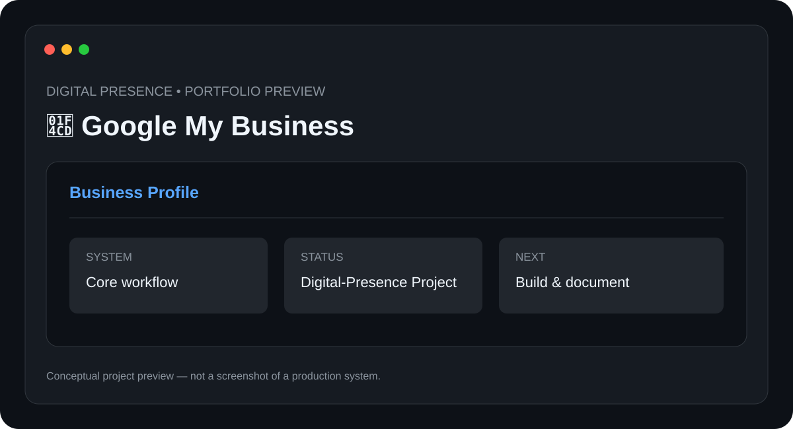

# 📍 Google My Business

> **Digital Presence** · **Status: Digital-Presence Project**



A local-business visibility project focused on improving a business's online presence through profile optimization, accurate information, content, and local discoverability.

## ✨ Features

- Business profile optimization
- Accurate business information
- Service and category organization
- Local SEO considerations
- Review and content workflow

## 🧰 Tech Stack

- **Google Business Profile**
- **Local SEO**
- **Content**
- **Analytics**

## 📁 Suggested Structure

```text
Google-My-Business/
├── README.md
├── preview.svg
├── src/ or app/
├── docs/
└── tests/
```

The implementation structure can evolve as the project is developed.

## ⚙️ Setup

1. Clone the repository.
2. Install the required runtime/tools for the stack above.
3. Configure any required environment variables, API keys, devices, or services.
4. Install project dependencies.
5. Run the project using the implementation-specific command documented here once the source is added.

### Initial setup checklist

- [ ] Create or claim the business profile
- [ ] Verify business information
- [ ] Configure categories and services
- [ ] Add photos and business description
- [ ] Monitor profile insights

> 🔐 Never commit API keys, passwords, private tokens, or device credentials.

## 🧪 Project Status

**Digital-Presence Project**

This repository is being documented as part of my technical portfolio. The project description and roadmap are based on the project listed in my resume; implementation details will be updated as the project is built and tested.

## 🗺️ Roadmap

1. ⬜ Create reporting workflow
2. ⬜ Track search visibility
3. ⬜ Build review-response templates
4. ⬜ Document local SEO experiments

## 📸 Preview

The included `preview.svg` is a **conceptual project preview**, not a fabricated production screenshot. Real screenshots will replace it after the corresponding implementation is built.

## 🤝 Contributing

This is currently a personal portfolio project. Suggestions and learning resources are welcome.

## 📄 License

No license has been selected yet. Licensing will be added when the project reaches a publishable implementation stage.

---

**Built and documented by [Mr-S-96](https://github.com/Mr-S-96).**
