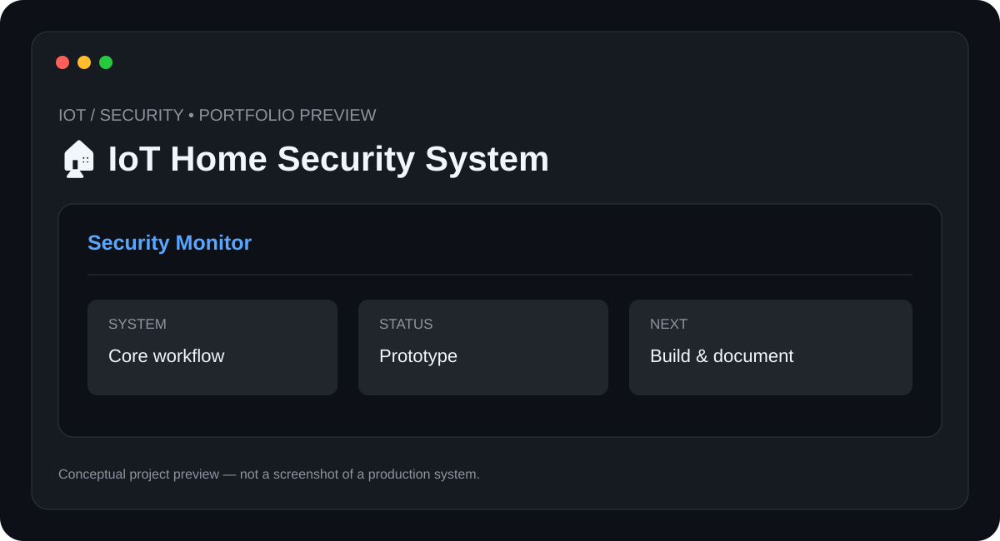

# 🏠 IoT Home Security System

> **IoT / Security** · **Status: Prototype / IoT Project**



An IoT security-system concept combining sensors, event detection, network communication, and notifications for home monitoring.

## ✨ Features

- Motion and sensor monitoring
- Event detection
- Alert workflow
- Network connectivity
- Security-state dashboard concept

## 🧰 Tech Stack

- **IoT**
- **Sensors**
- **Microcontrollers**
- **Networking**

## 📁 Suggested Structure

```text
IoT-Home-Security/
├── README.md
├── preview.svg
├── src/ or app/
├── docs/
└── tests/
```

The implementation structure can evolve as the project is developed.

## ⚙️ Setup

1. Clone the repository.
2. Install the required runtime/tools for the stack above.
3. Configure any required environment variables, API keys, devices, or services.
4. Install project dependencies.
5. Run the project using the implementation-specific command documented here once the source is added.

### Initial setup checklist

- [ ] Connect selected sensors and controller
- [ ] Configure the network
- [ ] Program sensor-event handling
- [ ] Configure notifications
- [ ] Test each sensor and alert path

> 🔐 Never commit API keys, passwords, private tokens, or device credentials.

## 🧪 Project Status

**Prototype / IoT Project**

This repository is being documented as part of my technical portfolio. The project description and roadmap are based on the project listed in my resume; implementation details will be updated as the project is built and tested.

## 🗺️ Roadmap

1. ⬜ Add camera integration
2. ⬜ Add mobile notifications
3. ⬜ Add secure remote access
4. ⬜ Add event history

## 📸 Preview

The included `preview.svg` is a **conceptual project preview**, not a fabricated production screenshot. Real screenshots will replace it after the corresponding implementation is built.

## 🤝 Contributing

This is currently a personal portfolio project. Suggestions and learning resources are welcome.

## 📄 License

No license has been selected yet. Licensing will be added when the project reaches a publishable implementation stage.

---

**Built and documented by [Mr-S-96](https://github.com/Mr-S-96).**
