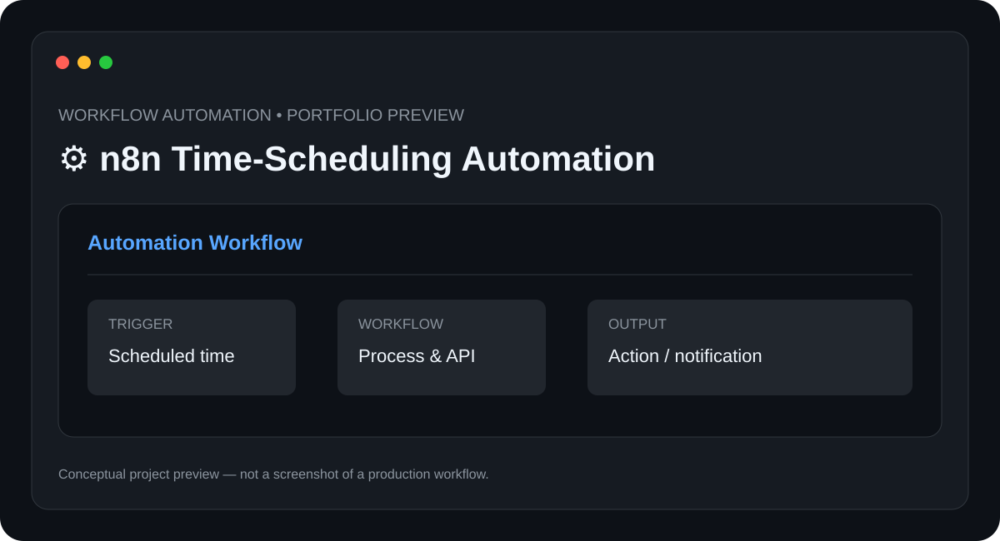

# ⚙️ n8n Time-Scheduling Automation

> **Workflow Automation** · **Status: Automation Prototype**

A workflow-automation project using **n8n** to schedule tasks, trigger actions at defined times, and connect services through APIs.

## ✨ Features

- Scheduled triggers
- Webhook integration
- Conditional workflow steps
- API-based actions
- Execution monitoring

## 🧰 Tech Stack

- **n8n**
- **Webhooks**
- **REST APIs**
- **Cron Scheduling**

## ⚙️ Setup

1. Install or access an n8n instance.
2. Create the workflow.
3. Configure credentials for connected services.
4. Set the schedule trigger.
5. Test and activate the workflow.

### Initial setup checklist

- [ ] Set up n8n
- [ ] Create the scheduled trigger
- [ ] Configure connected-service credentials
- [ ] Add workflow actions
- [ ] Test execution
- [ ] Add failure handling

> 🔐 Never commit API keys, passwords, private tokens, or service credentials.

## 🧪 Project Status

**Automation Prototype**

This repository is being documented as part of my technical portfolio. The project description is based on the n8n time-scheduling project listed in my resume; implementation details will be updated as the workflow is built and tested.

## 🗺️ Roadmap

1. ⬜ Add failure notifications
2. ⬜ Add reusable workflow templates
3. ⬜ Add execution reporting
4. ⬜ Add more API integrations

## 📸 Preview

The included `preview.svg` is a **conceptual project preview**, not a fabricated production screenshot. A real n8n screenshot will be added after the workflow is implemented.

## 🤝 Contributing

This is currently a personal portfolio project. Suggestions and learning resources are welcome.

## 📄 License

No license has been selected yet. Licensing will be added when the project reaches a publishable implementation stage.

---

**Built and documented by [Mr-S-96](https://github.com/Mr-S-96).**
