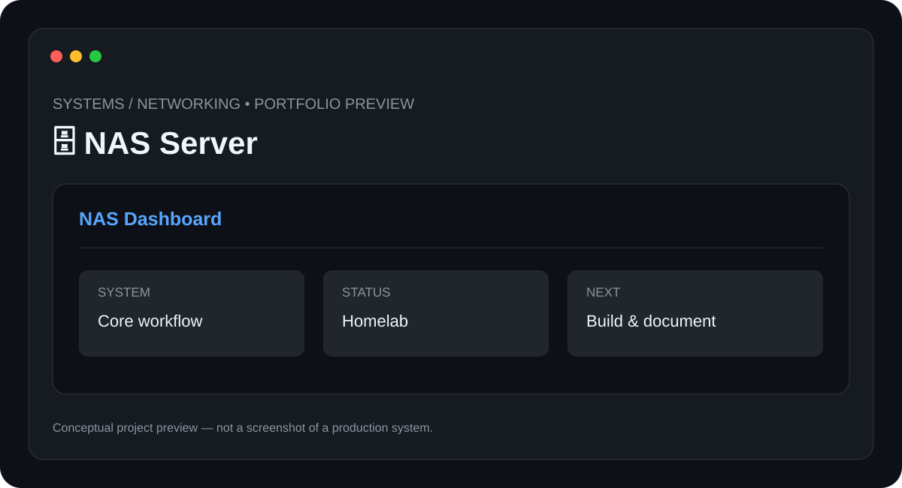

# 🗄️ NAS Server

> **Systems / Networking** · **Status: Homelab / Prototype**



A self-hosted network storage project for learning storage management, local networking, backups, and server administration.

## ✨ Features

- Centralized file storage
- Network file sharing
- User access management
- Backup strategy
- Storage monitoring

## 🧰 Tech Stack

- **Linux**
- **Networking**
- **Storage**
- **Server Administration**

## 📁 Suggested Structure

```text
NAS-Server/
├── README.md
├── preview.svg
├── src/ or app/
├── docs/
└── tests/
```

The implementation structure can evolve as the project is developed.

## ⚙️ Setup

1. Clone the repository.
2. Install the required runtime/tools for the stack above.
3. Configure any required environment variables, API keys, devices, or services.
4. Install project dependencies.
5. Run the project using the implementation-specific command documented here once the source is added.

### Initial setup checklist

- [ ] Prepare a Linux-based server
- [ ] Attach and configure storage drives
- [ ] Create storage volumes
- [ ] Configure network file sharing
- [ ] Create users and permissions
- [ ] Test local backups

> 🔐 Never commit API keys, passwords, private tokens, or device credentials.

## 🧪 Project Status

**Homelab / Prototype**

This repository is being documented as part of my technical portfolio. The project description and roadmap are based on the project listed in my resume; implementation details will be updated as the project is built and tested.

## 🗺️ Roadmap

1. ⬜ Add automated off-device backups
2. ⬜ Add monitoring dashboard
3. ⬜ Add containerized services
4. ⬜ Document disaster recovery

## 📸 Preview

The included `preview.svg` is a **conceptual project preview**, not a fabricated production screenshot. Real screenshots will replace it after the corresponding implementation is built.

## 🤝 Contributing

This is currently a personal portfolio project. Suggestions and learning resources are welcome.

## 📄 License

No license has been selected yet. Licensing will be added when the project reaches a publishable implementation stage.

---

**Built and documented by [Mr-S-96](https://github.com/Mr-S-96).**
