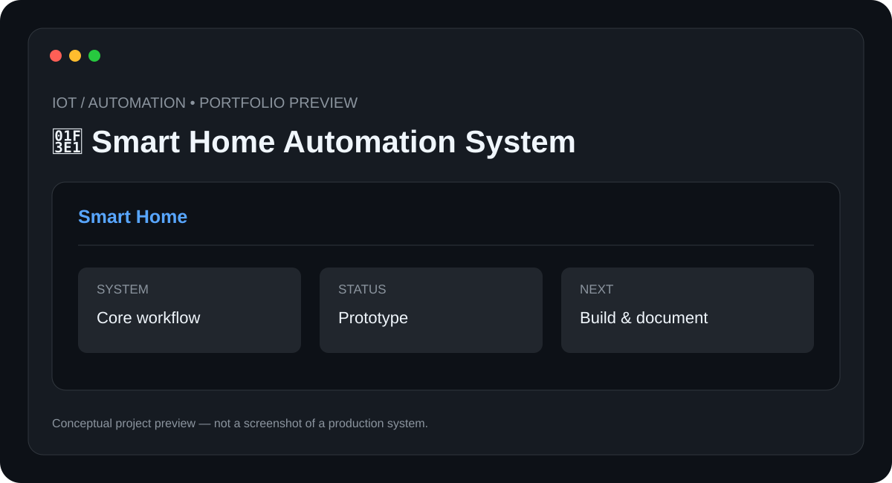

# 🏡 Smart Home Automation System

> **IoT / Automation** · **Status: Prototype / Automation Project**



A smart-home automation project exploring sensor-driven actions, scheduled workflows, device control, and centralized automation.

## ✨ Features

- Scheduled automation
- Sensor-triggered actions
- Device-state monitoring
- Central workflow logic
- Manual override concept

## 🧰 Tech Stack

- **IoT**
- **Automation**
- **Sensors**
- **n8n**

## 📁 Suggested Structure

```text
Smart-Home-Automation/
├── README.md
├── preview.svg
├── src/ or app/
├── docs/
└── tests/
```

The implementation structure can evolve as the project is developed.

## ⚙️ Setup

1. Clone the repository.
2. Install the required runtime/tools for the stack above.
3. Configure any required environment variables, API keys, devices, or services.
4. Install project dependencies.
5. Run the project using the implementation-specific command documented here once the source is added.

### Initial setup checklist

- [ ] Define devices and automation rules
- [ ] Connect supported sensors/devices
- [ ] Configure the automation controller
- [ ] Create workflows
- [ ] Test each trigger and action

> 🔐 Never commit API keys, passwords, private tokens, or device credentials.

## 🧪 Project Status

**Prototype / Automation Project**

This repository is being documented as part of my technical portfolio. The project description and roadmap are based on the project listed in my resume; implementation details will be updated as the project is built and tested.

## 🗺️ Roadmap

1. ⬜ Add voice control
2. ⬜ Add energy monitoring
3. ⬜ Add mobile dashboard
4. ⬜ Add advanced presence detection

## 📸 Preview

The included `preview.svg` is a **conceptual project preview**, not a fabricated production screenshot. Real screenshots will replace it after the corresponding implementation is built.

## 🤝 Contributing

This is currently a personal portfolio project. Suggestions and learning resources are welcome.

## 📄 License

No license has been selected yet. Licensing will be added when the project reaches a publishable implementation stage.

---

**Built and documented by [Mr-S-96](https://github.com/Mr-S-96).**
