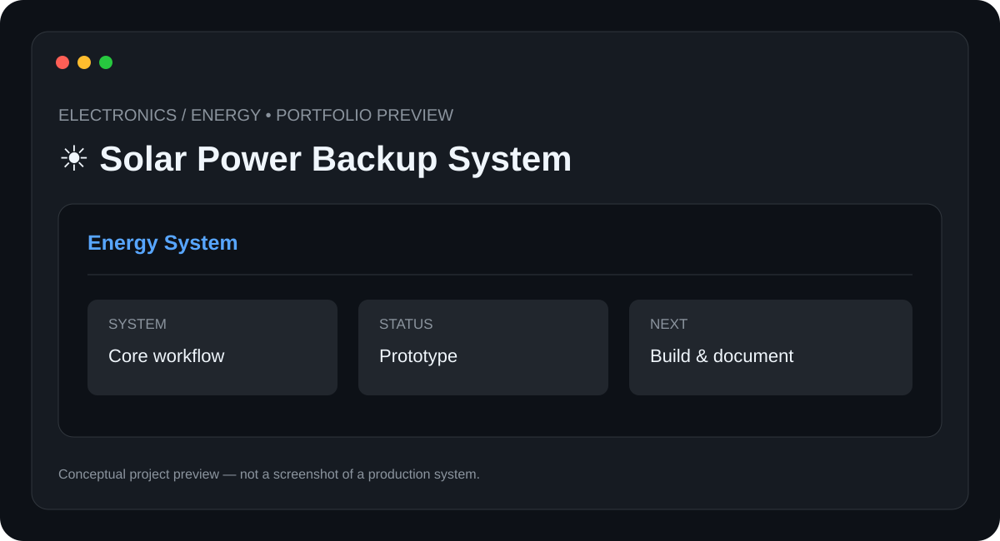

# ☀️ Solar Power Backup System

> **Electronics / Energy** · **Status: Prototype / Hardware Concept**



A solar backup-system project focused on understanding renewable power generation, battery storage, load management, and backup power design.

## ✨ Features

- Solar generation concept
- Battery storage
- Charge-control architecture
- Load management
- Power-status monitoring

## 🧰 Tech Stack

- **Solar PV**
- **Battery Storage**
- **Power Electronics**
- **Monitoring**

## 📁 Suggested Structure

```text
Solar-Power-Backup-System/
├── README.md
├── preview.svg
├── src/ or app/
├── docs/
└── tests/
```

The implementation structure can evolve as the project is developed.

## ⚙️ Setup

1. Clone the repository.
2. Install the required runtime/tools for the stack above.
3. Configure any required environment variables, API keys, devices, or services.
4. Install project dependencies.
5. Run the project using the implementation-specific command documented here once the source is added.

### Initial setup checklist

- [ ] Define load requirements
- [ ] Size the solar and battery system
- [ ] Select appropriate protection and charge-control components
- [ ] Build according to a verified electrical design
- [ ] Test charging, discharge, and protection behavior

> 🔐 Never commit API keys, passwords, private tokens, or device credentials.

## 🧪 Project Status

**Prototype / Hardware Concept**

This repository is being documented as part of my technical portfolio. The project description and roadmap are based on the project listed in my resume; implementation details will be updated as the project is built and tested.

## 🗺️ Roadmap

1. ⬜ Add energy monitoring
2. ⬜ Add remote status reporting
3. ⬜ Improve load prioritization
4. ⬜ Document measured performance

## 📸 Preview

The included `preview.svg` is a **conceptual project preview**, not a fabricated production screenshot. Real screenshots will replace it after the corresponding implementation is built.

## 🤝 Contributing

This is currently a personal portfolio project. Suggestions and learning resources are welcome.

## 📄 License

No license has been selected yet. Licensing will be added when the project reaches a publishable implementation stage.

---

**Built and documented by [Mr-S-96](https://github.com/Mr-S-96).**
