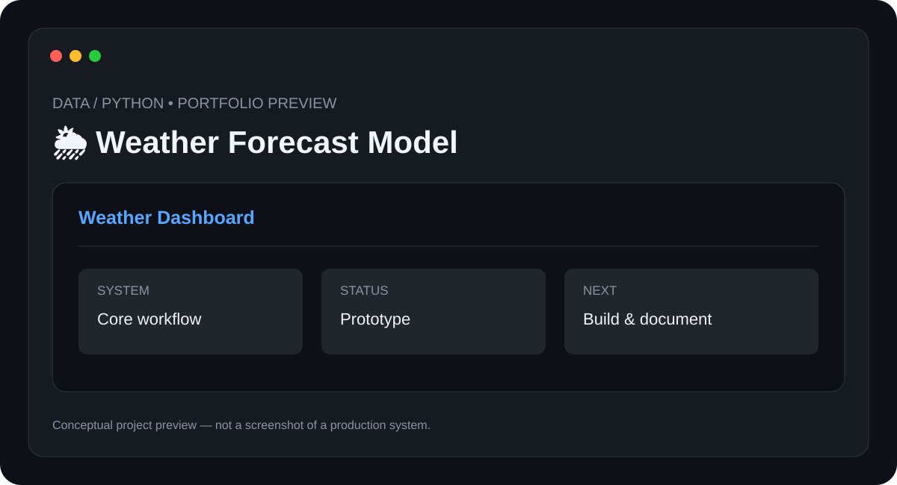

# 🌦️ Weather Forecast Model

> **Data / Python** · **Status: Prototype / Learning Project**



A weather-data project for exploring data collection, cleaning, analysis, forecasting concepts, and visual presentation.

## ✨ Features

- Weather data ingestion
- Data cleaning
- Historical analysis
- Forecasting workflow
- Readable visual summaries

## 🧰 Tech Stack

- **Python**
- **Data Analysis**
- **APIs**
- **Visualization**

## 📁 Suggested Structure

```text
Weather-Forecast-Model/
├── README.md
├── preview.svg
├── src/ or app/
├── docs/
└── tests/
```

The implementation structure can evolve as the project is developed.

## ⚙️ Setup

1. Clone the repository.
2. Install the required runtime/tools for the stack above.
3. Configure any required environment variables, API keys, devices, or services.
4. Install project dependencies.
5. Run the project using the implementation-specific command documented here once the source is added.

### Initial setup checklist

- [ ] Install Python 3.10+
- [ ] Install data-analysis dependencies
- [ ] Configure the weather-data source
- [ ] Run data preparation
- [ ] Generate forecast output and charts

> 🔐 Never commit API keys, passwords, private tokens, or device credentials.

## 🧪 Project Status

**Prototype / Learning Project**

This repository is being documented as part of my technical portfolio. The project description and roadmap are based on the project listed in my resume; implementation details will be updated as the project is built and tested.

## 🗺️ Roadmap

1. ⬜ Compare forecasting methods
2. ⬜ Add model evaluation
3. ⬜ Add automated daily updates
4. ⬜ Build an interactive dashboard

## 📸 Preview

The included `preview.svg` is a **conceptual project preview**, not a fabricated production screenshot. Real screenshots will replace it after the corresponding implementation is built.

## 🤝 Contributing

This is currently a personal portfolio project. Suggestions and learning resources are welcome.

## 📄 License

No license has been selected yet. Licensing will be added when the project reaches a publishable implementation stage.

---

**Built and documented by [Mr-S-96](https://github.com/Mr-S-96).**
