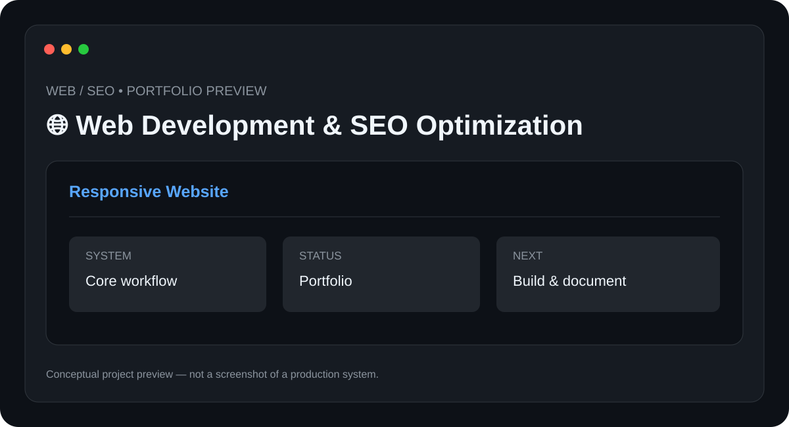

# 🌐 Web Development & SEO Optimization

> **Web / SEO** · **Status: Portfolio / Client-Work Area**



A collection of web-development and SEO practices used to build professional, responsive websites and improve their discoverability.

## ✨ Features

- Responsive layouts
- Custom styling
- Performance-minded structure
- SEO-friendly content structure
- Metadata and search optimization

## 🧰 Tech Stack

- **HTML**
- **CSS**
- **JavaScript**
- **WordPress**
- **SEO**

## 📁 Suggested Structure

```text
Web-Development-SEO/
├── README.md
├── preview.svg
├── src/ or app/
├── docs/
└── tests/
```

The implementation structure can evolve as the project is developed.

## ⚙️ Setup

1. Clone the repository.
2. Install the required runtime/tools for the stack above.
3. Configure any required environment variables, API keys, devices, or services.
4. Install project dependencies.
5. Run the project using the implementation-specific command documented here once the source is added.

### Initial setup checklist

- [ ] Choose the project website
- [ ] Create the page structure
- [ ] Implement responsive styling
- [ ] Add SEO metadata and structured content
- [ ] Test across desktop and mobile

> 🔐 Never commit API keys, passwords, private tokens, or device credentials.

## 🧪 Project Status

**Portfolio / Client-Work Area**

This repository is being documented as part of my technical portfolio. The project description and roadmap are based on the project listed in my resume; implementation details will be updated as the project is built and tested.

## 🗺️ Roadmap

1. ⬜ Add reusable components
2. ⬜ Add automated SEO checks
3. ⬜ Document performance benchmarks
4. ⬜ Publish selected case studies

## 📸 Preview

The included `preview.svg` is a **conceptual project preview**, not a fabricated production screenshot. Real screenshots will replace it after the corresponding implementation is built.

## 🤝 Contributing

This is currently a personal portfolio project. Suggestions and learning resources are welcome.

## 📄 License

No license has been selected yet. Licensing will be added when the project reaches a publishable implementation stage.

---

**Built and documented by [Mr-S-96](https://github.com/Mr-S-96).**
